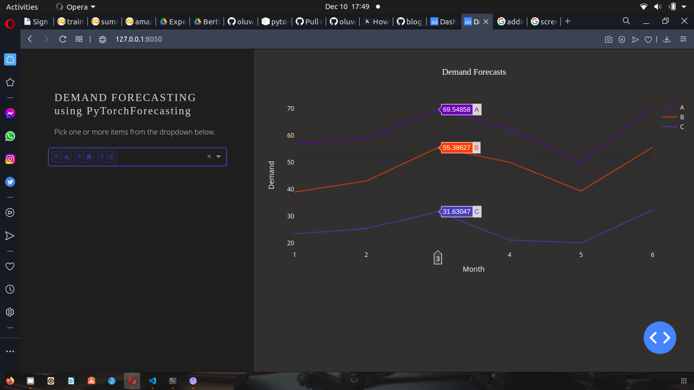

# pytorch-forecast-dashboard



#### Brief Intro
This repo demonstrates how pytorch-forecasting (a python library that uses deep learning for time series forecasting) can be combined with Dash (a python library for creating reactive, web-based apps) to build a full-stack predictive analytics application. The [stallion dataset](https://www.kaggle.com/utathya/future-volume-prediction) for SKU future volume analysis and prediction is used as a case study.

* [Official tutorial code](https://pytorch-forecasting.readthedocs.io/en/latest/tutorials/stallion.html) was adapted for forecasting.
* [This dash template](https://github.com/STATWORX/blog/tree/master/DashApp) was adapted for the dashboard.

#### Dependency
```
dash==1.18.0
pytorch-forecasting==0.7.1
pyarrow==2.0.0
```
#### Training the forecasting model
```
python forecaster/train.py
```

#### Model Evaluation
```
python forecaster/evaluate.py --best_model_path 'lightning_logs/default/version_0/checkpoints/epoch=20.ckpt'
```

#### Running the dash app
```
python app.py
```

